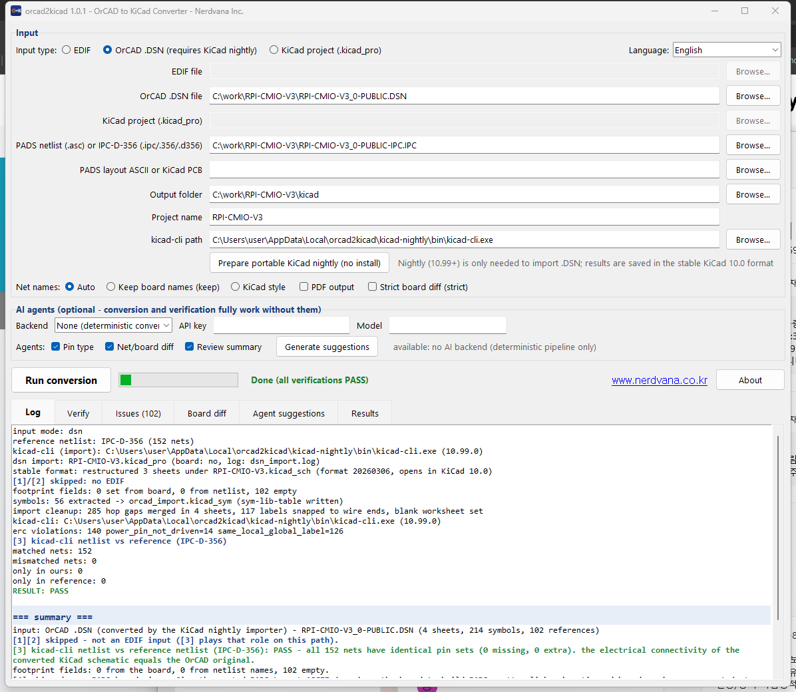
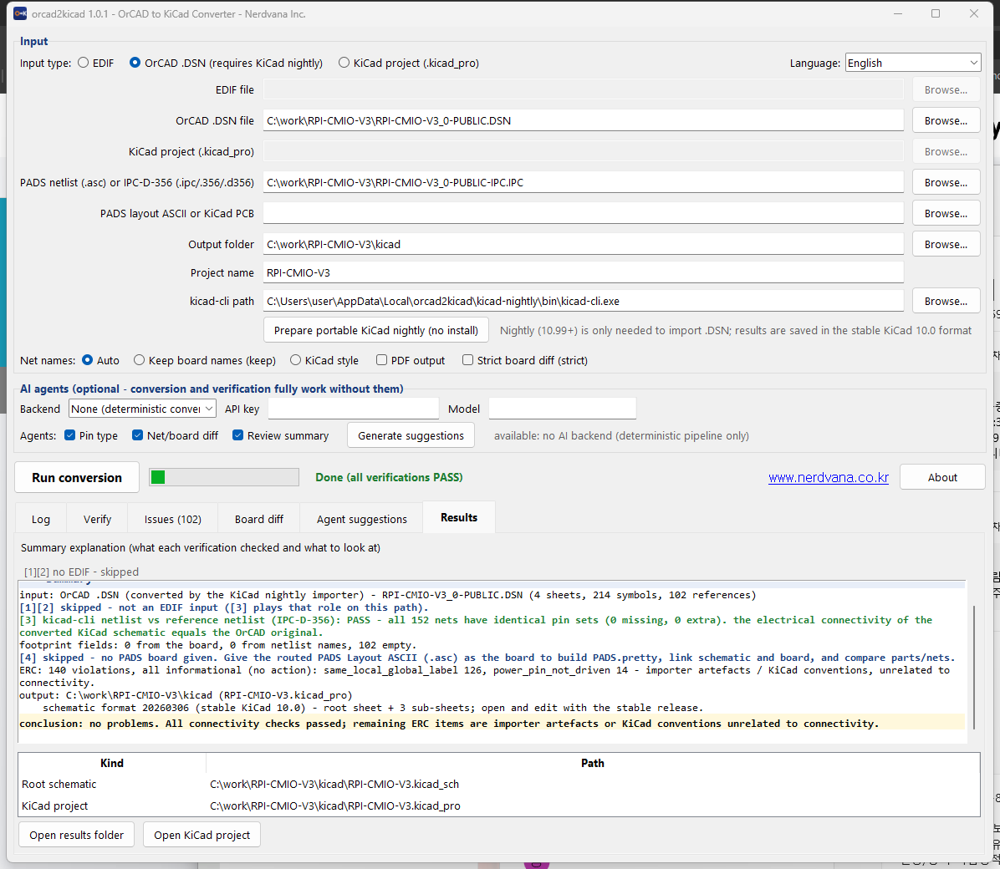

# orcad2kicad — OrCAD to KiCad schematic converter with netlist verification

한국어 README: [README.md](README.md) · English (this page)

**orcad2kicad** converts OrCAD Capture schematics — an EDIF 2.0.0 export or a
native OrCAD `.DSN` file — into a real, stable KiCad 10.0 project, and
verifies the result against a PADS-exported reference netlist so nets aren't
silently dropped or miswired. Built by [Nerdvana Inc.](https://www.nerdvana.co.kr)

[](LICENSE)
[](https://github.com/nerdvanainc/orcad2kicad/actions/workflows/tests.yml)
[](https://github.com/nerdvanainc/orcad2kicad/releases)

Teams migrating away from OrCAD run into the same problem: the conversion
finishes, but now someone has to eyeball every net to make sure nothing broke.
orcad2kicad doesn't stop at moving EDIF/DSN data into a KiCad schematic — it
folds PADS netlist verification into the pipeline so missing or miswired nets
are caught automatically, not by hand.

## Screenshots

| GUI main window (.DSN input, conversion log) | Results tab — netlist verification PASS |
|---|---|
|  |  |


*The converted schematic opened in KiCad 10.0 (part of one page).*

> The example circuit in these screenshots is a conversion of the publicly released
> Raspberry Pi Compute Module IO Board V3 design files (`RPI-CMIO-V3_0-PUBLIC.DSN`,
> © 2015 Raspberry Pi (Trading) Ltd). The design files are not included in this
> repository. The Raspberry Pi Foundation and Raspberry Pi (Trading) Ltd are not
> affiliated with and do not endorse this tool.

## What it does

- **OrCAD → KiCad conversion**: reads an OrCAD Capture `.DSN` file or an
  EDIF 2.0.0 export and produces a stable KiCad 10.0 project — a root sheet
  plus sub-sheets (`.kicad_sym` / `.kicad_sch` / `.kicad_pro`).
- **Netlist verification**: treats a PADS-exported `.asc` netlist, or an
  IPC-D-356/IPC-D-356A netlist exported from Cadence Allegro and other tools
  (both auto-detected from extension/content), as ground truth and
  cross-checks the converted schematic's connectivity net by net — with an
  EDIF input three independent ways (connectivity join, wire geometry,
  kicad-cli-exported netlist: [1][2][3]), with a `.DSN` input via the
  kicad-cli-exported netlist ([3]).
- **PADS board link**: given an existing PADS Layout ASCII board file,
  extracts its footprint library into `PADS.pretty`, fills in footprint
  fields on the schematic, and reports reference/pin differences between
  board and schematic ([4]) — enough to run KiCad's Update PCB from
  Schematic afterward.
- **Plain-language result summary**: verification results and ERC (Electrical
  Rule Check) findings are summarized by type, not dumped as raw logs.
- **Three interfaces**: a GUI (Korean/English), a CLI, and an MCP server so
  AI coding tools such as Claude Code can call the conversion/verification
  pipeline directly as a tool.
- **Optional AI suggestions**: an AI backend (Claude Code CLI, Codex CLI, or
  the Claude API) can suggest pin-type guesses, net-diff explanations, and
  review notes — suggestions only, never applied automatically. The
  deterministic pipeline runs the same way with or without an AI backend
  configured.

## Notice (summary)

- **This software does not read or convert OrCAD `.DSN` files itself.** `.DSN` parsing is done by KiCad's own
  OrCAD importer (kicad-cli nightly); orcad2kicad only cleans up and verifies that output.
- **No OrCAD installation, license, library or any other Cadence/OrCAD file is required or included.**
- **Verification is not a guarantee.** It is a comparison against your reference netlist; final design review
  and the rights to the designs you convert remain your responsibility.

Trademarks, the reverse-engineering statement, what is sent to an AI backend and more: see
**[NOTICE.en.md](NOTICE.en.md)** (한국어: [NOTICE.md](NOTICE.md)).

## Requirements

- **Windows**: run the packaged `orcad2kicad.exe` / `orcad2kicad-cli.exe`, no
  Python required.
- **From source** (Windows, Linux, or macOS): Python 3.10+, standard library
  only — no third-party packages needed for the core pipeline.
- **Stable KiCad 10.0** with `kicad-cli` on the system, for normal conversion,
  ERC, and netlist export.
- **KiCad nightly** is needed only to read `.DSN` files directly (stable
  KiCad does not yet ship the native `.DSN` importer). orcad2kicad fetches it
  as a portable extract — it downloads and unzips the nightly build, never
  runs an installer, so nothing is installed on your system.

## Download

- **Windows binaries**: get the latest release zip and `SHA256SUMS.txt` from
  the [Releases page](https://github.com/nerdvanainc/orcad2kicad/releases).
  Verify the download before trusting it:

  ```powershell
  Get-FileHash orcad2kicad-1.0.2-win64.zip -Algorithm SHA256
  ```

  Compare the output against the value in `SHA256SUMS.txt`.

- **From source** (any platform, no build step needed):

  ```bash
  git clone https://github.com/nerdvanainc/orcad2kicad.git
  cd orcad2kicad
  PYTHONPATH=src python -m orcad2kicad          # GUI
  PYTHONPATH=src python -m orcad2kicad.cli --help   # CLI
  ```

## Quick start

1. Download and unzip the release (or clone the source, see above).
2. Run `orcad2kicad.exe` (or `python -m orcad2kicad` from source).
3. Select your OrCAD `.DSN` or EDIF file as input.
4. Optionally add a PADS `.asc` netlist for verification and a PADS board
   file (`.asc` or `.kicad_pcb`) for board linking.
5. Click Run, then open the resulting `.kicad_pro` in KiCad.

## How do I convert an OrCAD schematic to KiCad?

Point orcad2kicad at an EDIF 2.0.0 export from OrCAD Capture (or a native
`.DSN` file — see below) and run the conversion. The pipeline is
deterministic: the same input always produces the same output, with symbols,
pins, nets, and coordinates translated by fixed rules, not by AI. The result
is a stable KiCad 10.0 project with a root sheet and sub-sheets you can open
directly. AI is used only for a handful of ambiguous, optional suggestions
(such as guessing an unclear pin type); nothing it suggests is applied
without you reviewing and accepting it in the GUI.

## Can I open an OrCAD .DSN file without OrCAD installed?

Yes. KiCad nightly builds include a native `.DSN` importer. orcad2kicad
drives that importer automatically, then reconstructs the result into the
stable KiCad 10.0 file format. If you don't already have a nightly build,
orcad2kicad's "prepare portable nightly" feature downloads the official
nightly archive and extracts it — no installer is run, so nothing is
installed on your system.

## How do I verify the conversion is correct?

"Converted" and "converted correctly" are different claims. orcad2kicad
treats a PADS-exported `.asc` netlist as the reference answer and compares
the converted KiCad schematic's connectivity against it net by net. With an
EDIF input there are three independent checks — an EDIF connectivity join
[1], wire geometry [2], and a netlist actually exported by kicad-cli [3];
with a `.DSN` input the kicad-cli netlist check [3] applies. If you also
supply a board file, a fourth check [4] compares the routed board against
the schematic (and, without a reference netlist, against the schematic
netlist). All of this is summarized in plain language, not raw diff output.

## How do I link my PADS board and use Update PCB from Schematic?

Pass an existing PADS board file (`.asc`, or an already-imported
`.kicad_pcb`) alongside your schematic input. orcad2kicad extracts the
board's footprints into a project-local `PADS.pretty` library, fills in
footprint fields on the converted schematic so they match, and reports any
reference or pin differences between the board and the new schematic. Once
that's done, KiCad's own "Update PCB from Schematic" command picks up from
there.

## FAQ

**EDIF or `.DSN` — which should I use?**
Prefer `.DSN`: it needs no OrCAD installation, keeps title blocks and text
placement closest to the original, and the result is written in the stable
KiCad 10.0 format. The only extra is a portable KiCad nightly build that
orcad2kicad downloads and extracts for you (never installed). Use the EDIF
2.0.0 export when you cannot download the nightly build or when you need
the EDIF-only checks [1][2].

**Which KiCad version do I need?**
Stable KiCad 10.0 is enough for normal conversion, verification, and PCB
work. KiCad nightly is only needed to read `.DSN` files directly without
OrCAD.

**Can I use this commercially?**
Yes. orcad2kicad is MIT-licensed open source — free for personal and
commercial use, source included.

**Does this work on Linux or macOS?**
The packaged `.exe` is Windows-only, but the tool is plain Python 3.10+
standard library, so it runs from source on Linux and macOS too (GUI and
CLI both). `kicad-cli` from a stable KiCad 10.0 install is still required
for conversion and verification on any platform.

**What language is the GUI in?**
Korean and English; the GUI follows your OS locale by default and can be
switched from its language menu. The CLI's output is English/ASCII.

## Documentation

- [docs/Quick_Start.en.md](docs/Quick_Start.en.md) — quick start (English)
- [docs/User_Manual.en.md](docs/User_Manual.en.md) — full user manual
  (English): installation, input preparation, GUI/CLI usage, reading
  verification results, AI backends, MCP registration, finishing up in
  KiCad, troubleshooting, known limitations
- [docs/HOW_IT_WORKS.md](docs/HOW_IT_WORKS.md) — developer overview:
  architecture, coordinate conventions, verification stages, module map
- Korean: [docs/Quick_Start.md](docs/Quick_Start.md),
  [docs/사용자설명서.md](docs/사용자설명서.md), [README.md](README.md)

## Testing

The full regression suite (about 420 tests) runs against reference designs
that cannot be published, so the sample-dependent tests are not part of this
public tree. The sample-independent tests that are included — synthetic
cases, the result explanation, GUI language tables, branding, and release
checks — run and pass here and in CI on Windows and Ubuntu (see
`.github/workflows/tests.yml`).

## Privacy

No telemetry. The only network access this program makes is (a) downloading
the KiCad nightly build or a 7-Zip console build when you explicitly request
it, and (b) calls to an AI backend (Claude API, or a local `claude`/`codex`
CLI) only if you have configured and enabled one for the optional suggestion
features.

When an AI backend is enabled, parts of your design data — net names, pin names, references,
footprint names — are sent to the selected service (the Anthropic API, or the service behind
the local CLI), and that service's terms and privacy policy apply to how it is processed. For
confidential designs, check your organization's policy before enabling it. With the default
(no backend) nothing is sent.

KiCad nightly and 7-Zip downloads come from each project's official distribution servers; the
integrity and safety of what is downloaded is the responsibility of those distributors, and it
is up to you to confirm that such downloads are permitted by your organization's network and
software policies.

## License

MIT — see [LICENSE](LICENSE). Third-party components bundled in the Windows
executables are listed in [THIRD_PARTY_NOTICES.md](THIRD_PARTY_NOTICES.md).

## About Nerdvana Inc.

[Nerdvana Inc.](https://www.nerdvana.co.kr) (㈜너드바나) is a Seoul-based
embedded hardware, firmware, and software development company. Besides tools
like orcad2kicad, we take on board design, firmware implementation, and
related software development work.

Contact / development inquiries: [www.nerdvana.co.kr/orcad2kicad](https://www.nerdvana.co.kr/orcad2kicad/) ·
[www.nerdvana.co.kr](https://www.nerdvana.co.kr) · sales@nerdvana.co.kr

