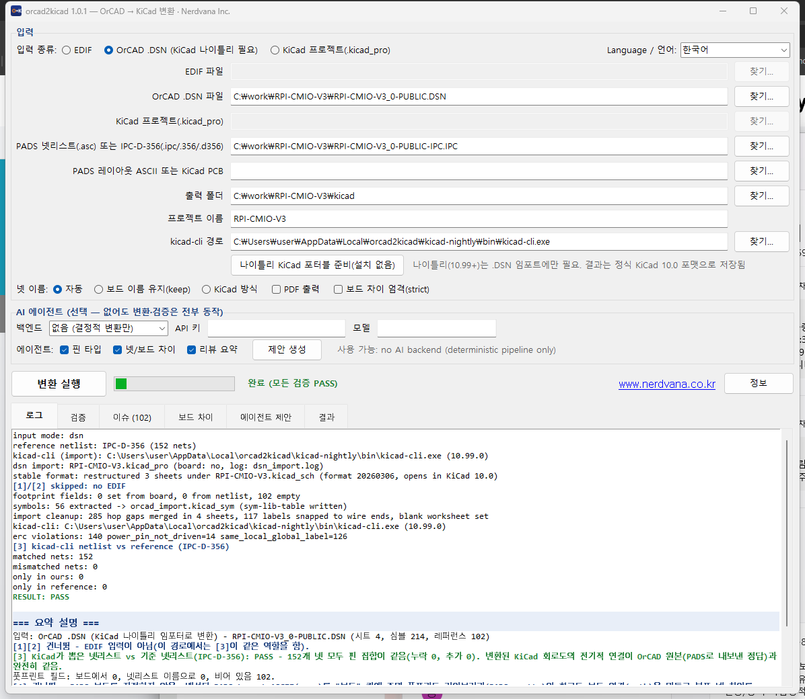
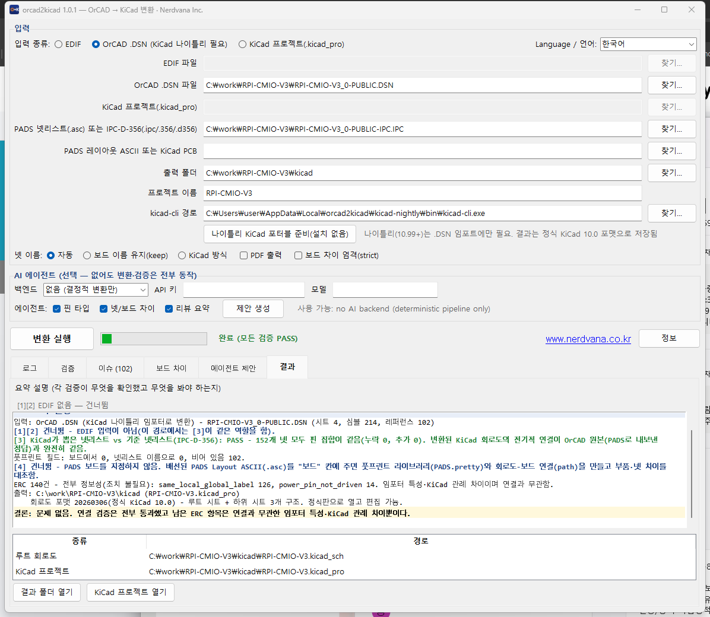
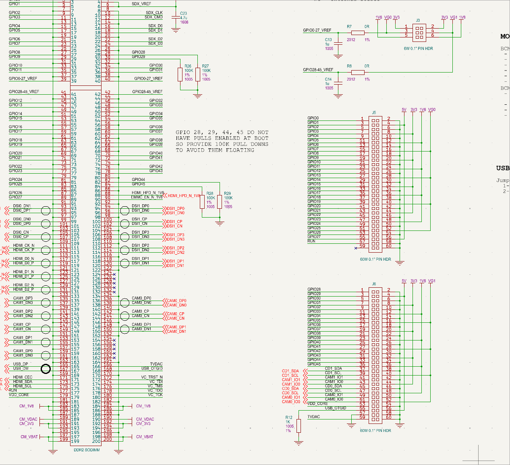

# orcad2kicad — 넷리스트 검증까지 갖춘 OrCAD → KiCad 회로도 변환기

한국어(이 페이지) · English: [README.en.md](README.en.md)

**제작·유지보수: [Nerdvana Inc.](https://www.nerdvana.co.kr) (㈜너드바나)** · 라이선스 MIT · [고지](NOTICE.md)

**orcad2kicad**는 OrCAD Capture 회로도(EDIF 2.0.0 익스포트 또는 OrCAD 네이티브
`.DSN` 파일)를 정식(stable) KiCad 10.0 프로젝트로 변환하고, PADS에서 내보낸
기준 넷리스트와 대조하여 넷이 빠지거나 잘못 연결되지 않았는지 검증하는
오픈소스 도구입니다.

[](LICENSE)
[](https://github.com/nerdvanainc/orcad2kicad/actions/workflows/tests.yml)
[](https://github.com/nerdvanainc/orcad2kicad/releases)

OrCAD에서 KiCad로 마이그레이션하려는 팀이 겪는 가장 큰 문제는 "변환은 됐는데
이게 맞게 됐는지 눈으로 다 확인해야 하는" 것입니다. orcad2kicad는 EDIF/DSN을
KiCad 회로도로 옮기는 것에서 그치지 않고, PADS 넷리스트 검증까지 파이프라인에
포함시켜 넷이 빠지거나 잘못 연결되지 않았는지 자동으로 대조합니다.

## 스크린샷

| GUI 메인 화면 (.DSN 입력, 변환 로그) | 결과 탭 요약 — 넷리스트 검증 PASS |
|---|---|
|  |  |



*KiCad 10.0에서 연 변환 결과 (회로 영역 일부).*

> 스크린샷의 예시 회로는 Raspberry Pi Compute Module IO Board V3 공개 설계 파일
> (`RPI-CMIO-V3_0-PUBLIC.DSN`, © 2015 Raspberry Pi (Trading) Ltd)을 변환한 것입니다.
> 설계 파일은 이 저장소에 포함되어 있지 않으며, Raspberry Pi 재단 및 Raspberry Pi
> (Trading) Ltd는 이 도구와 무관하고 이 도구를 보증하지 않습니다.

## 무엇을 하는 도구인가

- **OrCAD → KiCad 변환**: OrCAD Capture의 `.DSN` 파일 또는 EDIF 2.0.0 익스포트를
  읽어, 정식(stable) KiCad 10.0 프로젝트 — 루트 시트와 서브시트로 구성된
  `.kicad_sym` / `.kicad_sch` / `.kicad_pro` — 를 생성합니다.
- **넷리스트 검증**: PADS에서 내보낸 `.asc` 넷리스트, 또는 Cadence Allegro 등에서
  내보낸 IPC-D-356/IPC-D-356A 넷리스트(둘 다 확장자·내용으로 자동 판별)를 기준
  정답으로 삼아, 변환된 회로도의 넷 연결을 넷 단위로 대조합니다 — EDIF 입력이면
  연결 정보 조인·배선 지오메트리·kicad-cli 넷리스트 세 가지 독립 검증([1][2][3]),
  `.DSN` 입력이면 kicad-cli 넷리스트 검증([3]).
- **PADS 보드 연동**: 기존 PADS Layout ASCII 보드 파일을 함께 주면, 보드에 쓰인
  풋프린트 라이브러리를 `PADS.pretty`로 추출하고, 회로도의 풋프린트 필드를
  채우고, 보드와 회로도 사이의 레퍼런스·핀 차이를 리포트로 보여줍니다([4]) —
  이후 KiCad의 "Update PCB from Schematic"으로 바로 이어갈 수 있습니다.
- **알아보기 쉬운 결과 요약**: 검증 결과와 ERC(Electrical Rule Check) 결과를
  종류별로 정리해서 보여주며, 로그를 그대로 던져주지 않습니다.
- **세 가지 인터페이스**: GUI(한국어/영어), CLI, 그리고 MCP 서버(Claude Code
  같은 AI 코딩 도구가 변환·검증 기능을 툴로 직접 호출할 수 있도록 지원)를
  모두 제공합니다.
- **선택적 AI 제안**: AI 백엔드(Claude Code CLI, Codex CLI, 또는 Claude API)를
  연동하면 핀 타입 추정, 넷 차이 분석, 리뷰 제안을 받을 수 있습니다 — 어디까지나
  제안만 하며 자동 적용되지 않습니다. AI 백엔드를 설정하지 않아도 결정적
  파이프라인은 동일하게 동작합니다.

## 고지 (요약)

- **이 소프트웨어는 OrCAD `.DSN` 파일을 직접 읽거나 변환하지 않습니다.** `.DSN` 해석은 KiCad 자체의 OrCAD
  임포터(kicad-cli 나이틀리)가 수행하고, orcad2kicad는 그 결과를 정리·검증할 뿐입니다.
- **OrCAD의 설치·라이선스·라이브러리 등 어떤 Cadence/OrCAD 파일도 요구하거나 포함하지 않습니다.**
- **검증 결과는 보증이 아닙니다.** 기준 넷리스트와의 대조일 뿐이며, 설계 확인 책임과 변환 대상에 대한 권리는
  사용자에게 있습니다.

상표, 역공학 부인, AI 백엔드로 전송되는 데이터 등 전문은 **[NOTICE.md](NOTICE.md)** (영문: [NOTICE.en.md](NOTICE.en.md))를
참조하십시오.

## 요구 사항

- **Windows**: 패키징된 `orcad2kicad.exe` / `orcad2kicad-cli.exe`를 그대로
  실행합니다. Python이 필요 없습니다.
- **소스에서 실행** (Windows/Linux/macOS): Python 3.10+, 표준 라이브러리만으로
  핵심 파이프라인이 동작합니다(추가 패키지 불필요).
- **정식(stable) KiCad 10.0**과 `kicad-cli`가 시스템에 있어야 일반적인 변환·
  ERC·넷리스트 내보내기가 동작합니다.
- **KiCad 나이틀리(nightly)**는 `.DSN` 파일을 직접 읽을 때만 필요합니다(정식
  버전은 아직 `.DSN` 네이티브 임포터를 포함하지 않기 때문입니다). orcad2kicad는
  이를 포터블 형태로 준비해줍니다 — 나이틀리 빌드를 다운로드하고 압축을
  풀기만 할 뿐, 설치 프로그램을 실행하지 않으므로 시스템에 아무것도 설치되지
  않습니다.

## 다운로드

- **Windows 실행 파일**: 최신 릴리스 zip과 `SHA256SUMS.txt`는
  [Releases 페이지](https://github.com/nerdvanainc/orcad2kicad/releases)에서
  받을 수 있습니다. 다운로드 후 무결성을 확인하십시오.

  ```powershell
  Get-FileHash orcad2kicad-1.0.2-win64.zip -Algorithm SHA256
  ```

  출력된 해시 값을 `SHA256SUMS.txt`에 적힌 값과 비교해서 일치하는지
  확인하십시오.

- **소스에서 실행** (모든 플랫폼, 별도 빌드 과정 불필요):

  ```bash
  git clone https://github.com/nerdvanainc/orcad2kicad.git
  cd orcad2kicad
  PYTHONPATH=src python -m orcad2kicad          # GUI
  PYTHONPATH=src python -m orcad2kicad.cli --help   # CLI
  ```

## Quick Start

1. 위 Releases 페이지에서 zip을 받아 원하는 폴더에 압축을 풉니다(또는 위
   방법으로 소스를 클론합니다).
2. `orcad2kicad.exe`를 실행합니다(소스라면 `python -m orcad2kicad`).
3. 변환할 OrCAD `.DSN` 파일(또는 EDIF 파일)을 선택합니다.
4. 필요하면 검증용 PADS `.asc` 넷리스트, 그리고 보드 연동용 PADS 보드
   `.asc`/`.kicad_pcb` 파일도 함께 지정합니다(둘 다 선택 사항입니다).
5. [변환 실행] 버튼을 눌러 변환을 진행하고, 결과로 생성된 `.kicad_pro`를
   KiCad에서 엽니다.

## OrCAD 회로도를 KiCad로 변환하는 방법

orcad2kicad는 OrCAD Capture에서 내보낸 EDIF 2.0.0 파일(또는 `.DSN` 원본 파일)을
읽어, 심볼·핀·넷·좌표를 결정적(항상 같은 입력에는 같은 출력을 내는) 규칙으로
KiCad의 `.kicad_sym`(심볼 라이브러리), `.kicad_sch`(회로도, 루트 시트+서브시트),
`.kicad_pro`(프로젝트) 세 파일로 옮깁니다. 변환 로직에 AI를 쓰지 않는 것이
원칙이며, 값이 모호한 일부 항목(예: 핀 타입 추정)에 한해서만 선택적으로 AI
제안을 받을 수 있고, 그 제안도 자동 적용되지 않고 GUI에서 사용자가 직접
검토한 뒤 반영 여부를 결정합니다.

## OrCAD 없이 .DSN 파일을 KiCad에서 여는 방법

OrCAD 라이선스가 없어 `.DSN` 파일을 직접 열 수 없는 경우에도, KiCad 나이틀리
빌드에는 `.DSN`을 네이티브로 읽는 임포터가 들어 있습니다. orcad2kicad는 이
나이틀리 임포터를 자동으로 호출해 `.DSN`을 KiCad 프로젝트로 만든 다음, 그
결과를 다시 정식(stable) KiCad 10.0 포맷으로 재구성합니다. 나이틀리 빌드
자체가 없는 PC에서도, orcad2kicad의 "나이틀리 포터블 준비" 기능이 공식
배포처에서 압축 파일을 받아 풀어주기만 하면 되므로 별도의 설치 과정이
필요 없습니다.

## 변환 결과가 맞는지 검증하기

"변환됐다"와 "맞게 변환됐다"는 다른 이야기입니다. orcad2kicad는 PADS에서
내보낸 `.asc` 넷리스트를 정답으로 두고, 변환된 KiCad 회로도의 넷 연결을
넷 단위로 대조합니다. EDIF 입력이면 서로 독립적인 세 가지 검증 — EDIF
연결 정보 조인 [1], 배선 지오메트리 [2], kicad-cli로 실제 내보낸 넷리스트
[3] — 을, `.DSN` 입력이면 kicad-cli 넷리스트 검증 [3]을 수행합니다. 보드
파일까지 함께 주면 배선된 보드와 회로도의 대조 [4]가 더해집니다(정답
넷리스트가 없으면 회로도 넷리스트를 기준으로 대조). 이 모든 결과는 원시
diff가 아니라 알아보기 쉬운 요약으로 제공됩니다.

## PADS 보드와 연결해 Update PCB 쓰기

기존에 PADS로 설계된 보드가 있다면, 그 보드의 `.asc` 넷리스트(또는 이미
`.kicad_pcb`로 임포트된 파일)를 orcad2kicad에 함께 넘길 수 있습니다.
orcad2kicad는 보드에서 쓰인 풋프린트를 추출해 프로젝트 전용 `PADS.pretty`
라이브러리로 만들고, 변환된 회로도의 풋프린트 필드를 채우고, 보드에 남아
있는 레퍼런스·핀 구성과 새로 변환된 회로도를 서로 대조해 차이가 있는 부분을
리포트로 알려줍니다. 이렇게 연결해 두면 KiCad의 "Update PCB from Schematic"
기능으로 이후 작업을 바로 이어갈 수 있습니다.

## FAQ

**EDIF와 `.DSN` 중 어느 것을 입력해야 하나요?**
`.DSN`을 권합니다. OrCAD 설치가 필요 없고, 타이틀 블록·텍스트 배치가 원본에
가장 가깝게 옮겨지며, 결과는 정식 KiCad 10.0 포맷으로 저장됩니다. 추가로
필요한 것은 orcad2kicad가 내려받아 압축만 푸는 포터블 KiCad 나이틀리뿐입니다
(설치되지 않습니다). 나이틀리를 내려받을 수 없거나 EDIF 전용 검증 [1][2]가
필요할 때 EDIF 2.0.0 익스포트를 쓰십시오.

**KiCad 몇 버전이 필요한가요?**
일반적인 변환·검증·PCB 작업에는 정식(stable) KiCad 10.0이면 충분합니다.
`.DSN` 파일을 OrCAD 없이 직접 읽는 경우에만 나이틀리 빌드가 추가로
필요합니다.

**상업적으로 사용해도 되나요?**
예. orcad2kicad는 MIT 라이선스 오픈소스입니다 — 개인·상업적 사용 모두
무료이며, 소스 코드도 함께 제공됩니다.

**Linux나 macOS에서도 쓸 수 있나요?**
패키징된 `.exe`는 Windows 전용이지만, 도구 자체는 Python 3.10+ 표준
라이브러리만으로 동작하므로 소스에서 실행하면 Linux·macOS에서도 GUI·CLI
모두 사용할 수 있습니다. 어느 플랫폼이든 변환·검증에는 정식 KiCad 10.0의
`kicad-cli`가 필요합니다.

**GUI는 어떤 언어를 지원하나요?**
한국어와 영어를 지원하며, 기본값은 OS 로캘을 따르고 GUI의 언어 메뉴에서
전환할 수 있습니다. CLI 출력은 영문(ASCII)입니다.

## 문서

- [docs/Quick_Start.md](docs/Quick_Start.md) — 빠르게 시작하기
- [docs/사용자설명서.md](docs/사용자설명서.md) — 설치, 입력 파일 준비, GUI/CLI
  사용법, 검증 결과 읽는 법, AI 백엔드 설정, MCP 등록, KiCad 마무리 작업,
  문제 해결, 알려진 제한까지 담은 전체 사용자 설명서
- 영어: [docs/Quick_Start.en.md](docs/Quick_Start.en.md),
  [docs/User_Manual.en.md](docs/User_Manual.en.md),
  [docs/HOW_IT_WORKS.md](docs/HOW_IT_WORKS.md), [README.en.md](README.en.md)

## 테스트

전체 회귀 테스트(약 420개)는 공개할 수 없는 참조 설계 데이터로 돌기 때문에
샘플 의존 테스트는 이 공개 트리에 들어 있지 않습니다. 포함된 샘플 비의존
테스트 — 합성 케이스, 결과 요약(explain), GUI 언어 표, 브랜딩, 릴리스 검사 —
는 이 트리에서 그대로 통과하며, Windows/Ubuntu CI(`.github/workflows/tests.yml`)
에서 실행됩니다.

## 개인정보 및 네트워크 접근

orcad2kicad는 사용 현황을 수집하는 텔레메트리를 포함하지 않습니다. 프로그램이
네트워크에 접근하는 경우는 다음 두 가지뿐입니다.

1. 사용자가 GUI 버튼을 클릭하거나 CLI 옵션을 지정해 KiCad 나이틀리 또는
   7-Zip 콘솔판 다운로드를 명시적으로 요청한 경우
2. 사용자가 AI 백엔드(Claude API, 또는 로컬 `claude`/`codex` CLI)를 직접
   설정하고 선택적 제안 기능을 활성화한 경우에 한해, 해당 백엔드에 요청을
   보내는 경우

이 두 가지 외에는 프로그램이 자체적으로 어떤 서버와도 통신하지 않습니다.

AI 백엔드를 활성화하면 넷 이름·핀 이름·레퍼런스·풋프린트 이름 등 설계 정보의 일부가
선택한 서비스(Anthropic API, 또는 로컬 CLI가 연결된 서비스)로 전송되며, 그 처리에는
해당 서비스의 약관과 개인정보 정책이 적용됩니다. 기밀 설계라면 사용 전에 소속 조직의
정책을 확인하십시오. 기본값(백엔드 없음)에서는 아무것도 전송되지 않습니다.

KiCad 나이틀리와 7-Zip 다운로드는 각 프로젝트의 공식 배포 서버에서 이루어지며, 그
내용물의 무결성·안전성은 각 배포자의 책임입니다. 조직의 네트워크·소프트웨어 정책상
허용되는지는 사용자가 확인해야 합니다.

## 라이선스

MIT — [LICENSE](LICENSE) 참조. Windows 실행 파일에 포함되는 서드파티 구성
요소는 [THIRD_PARTY_NOTICES.md](THIRD_PARTY_NOTICES.md)에 정리되어 있습니다.

## 회사 소개

[Nerdvana Inc.](https://www.nerdvana.co.kr)(㈜너드바나)는 서울에 있는 임베디드
하드웨어·펌웨어·소프트웨어 개발사입니다. orcad2kicad와 같은 도구뿐 아니라
실제 보드 설계, 펌웨어 구현, 관련 소프트웨어 개발 의뢰도 받고 있습니다.

개발 의뢰·문의: [www.nerdvana.co.kr/orcad2kicad](https://www.nerdvana.co.kr/orcad2kicad/) ·
[www.nerdvana.co.kr](https://www.nerdvana.co.kr) · sales@nerdvana.co.kr
